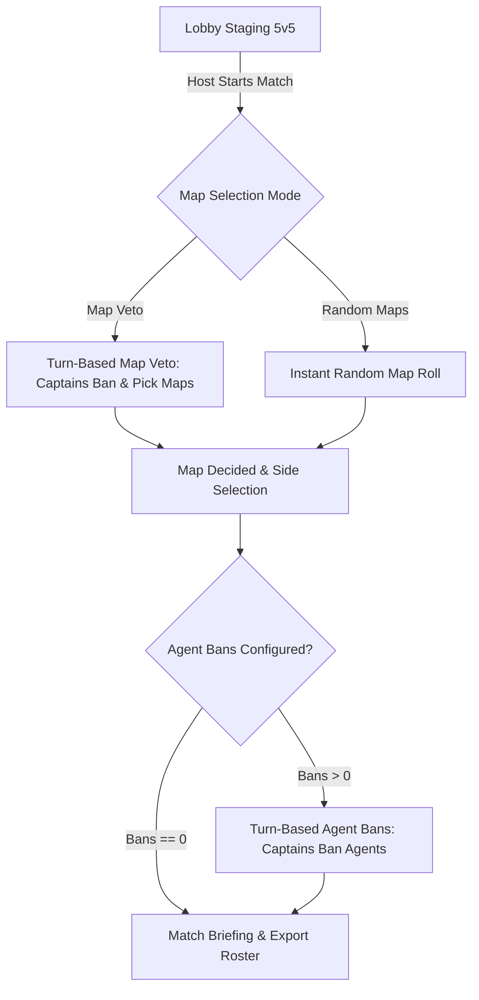

# VALORANT 10-Player Custom Tournament & Scrim Lobby Design

## 1. Overview & Goal
Build a dedicated 10-player (5v5) custom scrim and tournament lobby (`/tournament` or `/custom`) in GameTeamer. It enables two competitive teams (Team Alpha vs Team Omega) to join an interactive online lobby, configure match rules (BO1, BO3, BO5), conduct an esports-style Map Veto (or Random Map roll), and execute turn-based Captain Agent Bans with real-time Supabase synchronization.

---

## 2. User Experience & Route Structure
- **Entry Points:**
  - Featured 4th card on the homepage (`/`) with a tournament stage aesthetic.
  - Dedicated route: `/tournament` (also supports `/tournament?code=XYZ` for direct invite links).
- **Lobby Experience:**
  - Setup screen: Enter Nickname, choose "Create Tournament Lobby" or "Join Tournament Lobby" with 6-character room code.
  - 10-player capacity:
    - **Team Alpha (Blue / Cyan accent):** 5 slots (Slot 1 = Captain Alpha).
    - **Team Omega (Red / Orange accent):** 5 slots (Slot 1 = Captain Omega).
    - Switch Team buttons allow players to move between Team Alpha and Team Omega.
  - Host Settings Modal (Host is the room creator):
    - Match Format: `BO1` (1 map), `BO3` (3 maps), `BO5` (5 maps).
    - Map Selection Mode: `Map Veto (Turn-Based)` or `Random Maps`.
    - Bans Per Team: `0`, `1`, `2`, or `3` Agent Bans per team (default: 2).
    - Map Pool: Official VALORANT active maps (Ascent, Bind, Haven, Split, Icebox, Breeze, Lotus, Sunset, Abyss, Pearl, Fracture).

---

## 3. Tournament Phases & Flow

### Phase Details:
1. **Lobby Staging:**
   - Players join and pick sides.
   - Host reviews settings and clicks "Begin Tournament Veto".
2. **Map Phase (Veto vs Random):**
   - **BO1 Veto:** Captain A Ban -> Captain B Ban -> Captain A Ban -> Captain B Ban -> Captain A Ban -> Captain B Ban -> Decider Map remaining. Team B chooses starting side (Attack/Defense).
   - **BO3 Veto:** Captain A Ban -> Captain B Ban -> Captain A Pick Map 1 (Team B chooses side) -> Captain B Pick Map 2 (Team A chooses side) -> Captain A Ban -> Captain B Ban -> Decider Map 3 (Team A chooses side).
   - **Random Mode:** System shuffles and selects N distinct maps from the active pool with sound effects and roll animation.
3. **Agent Ban Phase:**
   - Active only if host configured `bansPerTeam > 0`.
   - Captains alternate banning agents (e.g. Captain Alpha bans 1, Captain Omega bans 1...).
   - Banned agents are watermarked with red slashed overlay, disabled from any team selection, and added to the official Match Ban List.
4. **Match Summary & Briefing:**
   - Displays final Map(s) in order with assigned starting sides.
   - Displays all banned agents.
   - Displays full 5v5 rosters.
   - Quick "Copy Match Summary" button formatted for Discord / in-game chat.
   - Option for Host to "Reset Match" or "Start New Veto".

---

## 4. Architecture & Realtime Synchronization
- **State Management:**
  - Lightweight, low-latency Supabase Realtime channel `tournament-room:${code}` with:
    - `presence`: Tracks presence of up to 10 players, their slot index, and assigned team (Alpha or Omega).
    - `broadcast`:
      - `TOURNAMENT_ACTION`: optimistic local execution with broadcast of moves (map ban, map pick, side pick, agent ban).
      - `TOURNAMENT_STATE_SYNC`: full match state request/response when new players join or reconnect.
      - `SETTINGS_UPDATE`: updates format, bans per team, or map pool.
- **Audio & Assets:**
  - Local high-res VALORANT map images and active agent portraits from `public/valorant/`.
  - Sound effects synthesized through `soundManager` (action click, ban buzzer, pick lock-in, fanfare).

---

## 5. Non-Functional Requirements
- **Performance:** 0ms optimistic UI responsiveness on Captain actions before network roundtrip.
- **Resilience:** Graceful fallback if any player disconnects (Host can reassign captaincy or force-step turn).
- **Responsive Design:** Premium dark-mode esports broadcast UI matching GameTeamer design system (Tailwind CSS, framer-motion animations, Glassmorphism, noise overlay).
